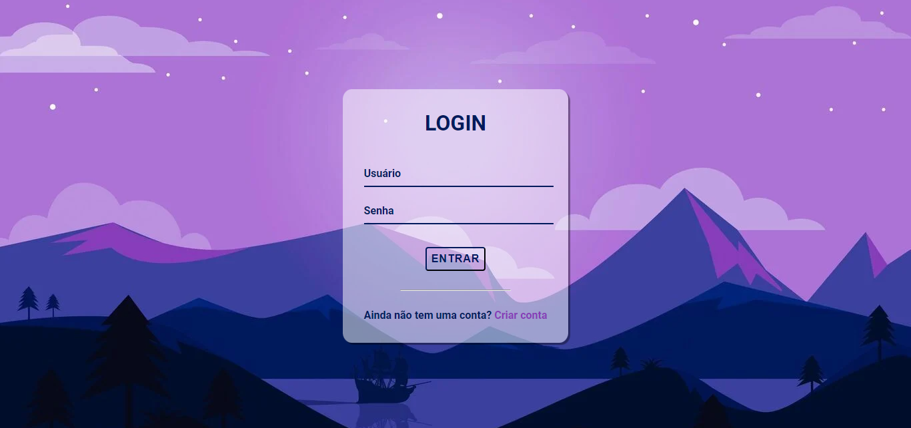

<h1 align="center"> Tela de Login </h1>

<a href="#-projeto">Projeto</a>&nbsp;&nbsp;&nbsp;|&nbsp;&nbsp;&nbsp;
  <a href="#-tecnologias">Tecnologias</a>&nbsp;&nbsp;&nbsp;|&nbsp;&nbsp;&nbsp;
  <a href="#-layout">Layout</a>&nbsp;&nbsp;&nbsp;|&nbsp;&nbsp;&nbsp;
  <a href="#memo-licença">Licença</a>

  

 

  <video src="./.github/demo.mp4" controls>

## 🚀 Tecnologias

Esse projeto foi desenvolvido com as seguintes tecnologias:

- HTML e CSS

## 💻 Projeto

Referente ao meu conhecimento com as linguagens HTML e CSS, resolvi me desafiar a criar uma tela de login.

## 🔖 Layout

  

## :memo: Licença

Esse projeto está sob a licença MIT.

---

Feito com ❤️ by Pedro Henriqque